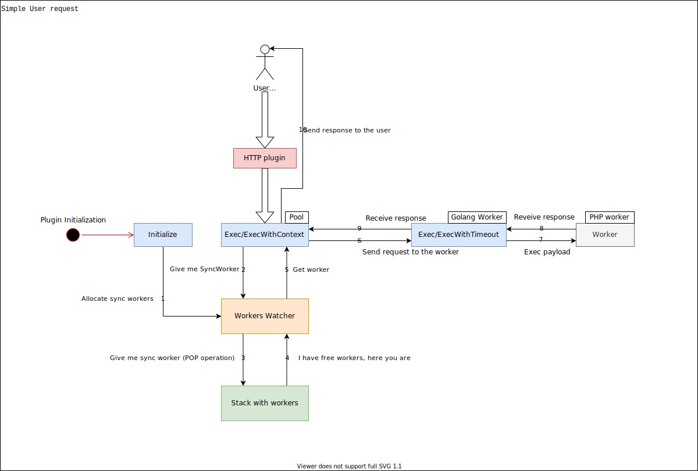

This is the drawio diagrams showing basic workflows inside RoadRunner 2.0

Simple HTTP workflow description:
  

1. Allocate sync workers. When plugin starts (which use workers pool), then it allocates required number of processes
   via `cmd.exec` command.
    
2. When user send HTTP request to the RR2, HTTP plugin receive it and transfer to the workers pool `Exec/ExecWithContex`
method. And workers pool ask Worker watcher to get free worker.
   
3. Workers watcher uses stack data structure under the hood and making POP operation to get first free worker. If there are
no workers in the `stack`, watcher waits for the specified via config (`allocate_timeout`) time.
   
4. Stack returns free worker to the watcher.
5. Watcher returns that worker to the `pool`.
6. Pool invoke `Exec/ExecWithTimeout` method on the golang worker with provided request payload.
7. Golang worker send that request to the PHP worker via various set of transports (`pkg/transport` package).
8. PHP worker send back response to the golang worker (or error via stderr).
9. Golang worker return response payload to the pool.
10. Pool process this response and return answer to the user.
